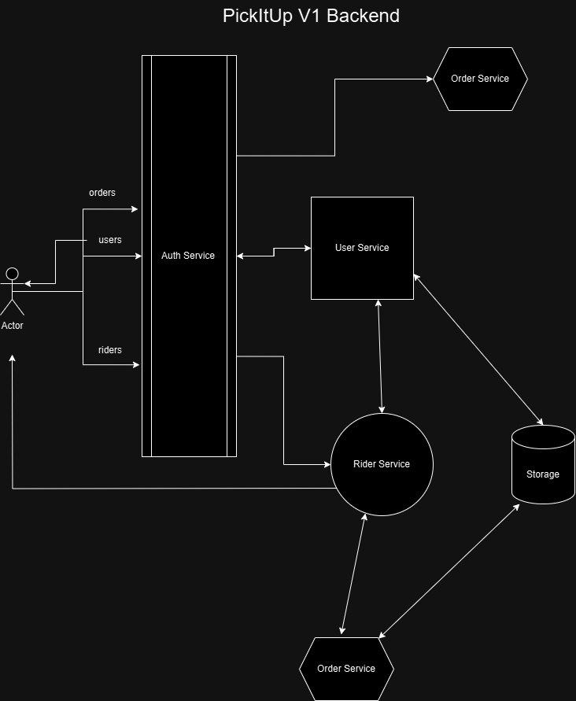
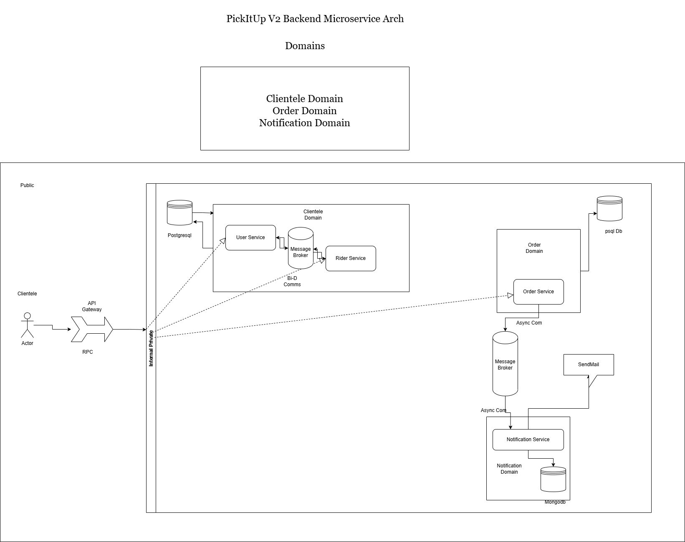

PickItUp API V1.0
Need a Rider to Pick Up your order from any local market with safe and fast delivery?, well we've got you.

This codebase contains all MVP business logic design, functionality and system design for the ideal application of users browsing all available riders, selecting a rider base on stats and merits to send pickitup orders to.



## Tools Used
- Go
- Gorilla Mux
- Goroutines
- Docker/Docker Compose
- PostgreSQL
- Redis

## Pickitup V1 Available Endpoints and Their Business Logic Description

### Auth Service Endpoints
- Register `/register` `POST`  All User's registration endpoint
```go
func (h *userHandler) handleRegister(w http.ResponseWriter, r *http.Request) {
	var payload dto.RegisterUserDTO
	err := utils.ParseJSON(r, &payload)
	if err!= nil {
        utils.WriteError(w, http.StatusBadRequest, "Invalid Payload")
        return
    }
	// validate
	if vErr := utils.Validate.Struct(payload); vErr != nil {
		errs := vErr.(validator.ValidationErrors)
		if strings.Contains(errs.Error(), "Email") {
			utils.WriteError(w, http.StatusBadRequest, "Invalid Email Format")
            return
		} else if strings.Contains(errs.Error(), "Password") {
			utils.WriteError(w, http.StatusBadRequest, "Password Too Weak")
            return
		}
		utils.WriteError(w, http.StatusBadRequest, "Bad Data!")
		return
	}
	email := payload.Email

	_, errr := h.repo.GetUserByEmail(email)
	if errr == nil {
        utils.WriteError(w, http.StatusConflict, "User with this email already exists")
        return
    }
	// hash the user password before save
	password := payload.Password
	hashedPassword, err := auth.HashPassword(password)
	if err!= nil {
        utils.WriteError(w, http.StatusInternalServerError, "Something went wrong")
        return
    }
	
	// create user with the new hashed password
	newErr := h.repo.CreateUser(&models.User{
		UserName: payload.UserName,
		Password: hashedPassword,
		Email: payload.Email,
		PhoneNumber: payload.PhoneNumber,
	})
	if newErr != nil {
		err := newErr.Error()
		if strings.Contains(err, "uni_users_phone_number") {
			utils.WriteError(w, http.StatusConflict, "User with this phone number already exists")
            return
		}
		utils.WriteError(w, http.StatusInternalServerError, "Something went wrong")
        return
    }
	// genarate and cache random number
	num, err := utils.GenerateAndCacheVerificationCode(payload.Email)
	if err!= nil {
        log.Println("Generate Code Failed: ", err)
    } else {
		// send the email to verify
		msg := fmt.Sprintf("Your verification code is %d\n", num)
		err = utils.SendMail(payload.Email, "Email Verification", payload.UserName, msg)
        if err!= nil {
            log.Printf("Email sending failed due to %v\n", err)
        }
	}

	utils.WriteJSON(w, http.StatusCreated, "success", nil, "User Successfully Created!")

}
```
- Login `/login` `POST` All User's login endpoint
- Register Rider `/register/riders` `POST` Registers and creates a new rider user.
riders and users are related to one another on a one to one basis, hence once a riders is registered its creates it associated user, however when when a user is registered it only creates the user.

```go
func(h *riderHandler) handleRegisterRider(w http.ResponseWriter, r *http.Request) {
	// pend for now
	var payload dto.RegisterRiderDTO
	if err := utils.ParseJSON(r, &payload); err!= nil {
        utils.WriteError(w, http.StatusBadRequest, "Invalid Rider Registration Details")
        return
    }

	// validate
	if vErr := utils.Validate.Struct(payload); vErr != nil {
		errs := vErr.(validator.ValidationErrors)
		if strings.Contains(errs.Error(), "Email") {
			utils.WriteError(w, http.StatusBadRequest, "Invalid Email Format")
            return
		} else if strings.Contains(errs.Error(), "Password") {
			utils.WriteError(w, http.StatusBadRequest, "Password Too Weak")
            return
		}
		log.Println(errs.Error())
		utils.WriteError(w, http.StatusBadRequest, "Bad Data!")
		return
	}
	password := payload.Password
	hashedPassword, err := auth.HashPassword(password)
	if err!= nil {
        utils.WriteError(w, http.StatusInternalServerError, "Something went wrong")
        return
    }

	user := &models.User{
		UserName: payload.UserName,
		Password: hashedPassword,
		Email: payload.Email,
		PhoneNumber: payload.PhoneNumber,
	}
	if h.userRepo == nil {
		log.Println("User Repository not provided")
		utils.WriteError(w, http.StatusInternalServerError, "User Repository not provided")
        return
    }

	newErr := h.userRepo.CreateUser(user)

	if newErr != nil {
		log.Println("Got Here")
		err := newErr.Error()
		if strings.Contains(err, "uni_users_phone_number") {
			utils.WriteError(w, http.StatusConflict, "User with this phone number already exists")
            return
		} else if strings.Contains(err, "uni_users_email") {
			utils.WriteError(w, http.StatusConflict, "User with this email already exists")
            return
		}
		utils.WriteError(w, http.StatusInternalServerError, "Something went wrong")
        return
    }
	// create Rider
	rider := models.Rider{
        UserID: user.ID,
        FirstName: payload.FirstName,
		LastName: payload.LastName,
        Address: payload.Address,
        NextOfKinName: payload.NextOfKinName,
		NextOfKinPhone: payload.NextOfKinPhone,
        DriverLicenseNumber: payload.DriverLicenseNumber,
        NextOfKinAddress: payload.NextOfKinAddress,
		BikeNumber: payload.BikeNumber,
    }

    err = h.repo.CreateRider(&rider)
    if err!= nil {
        utils.WriteError(w, http.StatusInternalServerError, "Something went wrong")
        return
    }
	// send verfication code
	num, err := utils.GenerateAndCacheVerificationCode(payload.Email)
    if err!= nil {
        log.Println("Generate Code Failed: ", err)
    } else {
        // send the email to verify
        msg := fmt.Sprintf("Your verification code is %d\n", num)
        err = utils.SendMail(payload.Email, "Email Verification", payload.UserName, msg)
        if err!= nil {
            utils.WriteError(w, http.StatusInternalServerError, "Failed to send verification email")
            return
        }
    }

    utils.WriteJSON(w, http.StatusCreated, "success", nil, "Rider Successfully Created!")
}
```
### User Service Endpoints
- Give a rider a review `/{rider_id}/ratings` `POST` gives a rider a review which will be used to rate riders, thus users can user this metric to select the rider the rider they among list of riders. This endpoint is only authorized to users alone, therefore a rider is not allowed give him/herself a review 

### Rider Service Endpoints
- Get all Riders `/riders` `GET` this endpoint retrieves all riders available
- Get a rider `/riders/{id}` `GET` this enpoints retrieves a rider by its id
- Update rider min and max charges `/riders/charges` `PATCH` this endpoint updates the rider min and max charges **Only Riders Authorized**
- update rider status `/riders/status` `PATCH` this endpoint updates rider availability status to any of the the following enum values choices: `Available Unavailable On Break Busy` `PATCH` base on the request payload **Only Riders Authorized**

### Order Service Endpoints
- Send a rider an order `/orders/{rider_id}` `POST` this endpoints creates a pickup order for a rider and sends a concurrent email to of the newly created to the rider and the user clientele.
On order creation, the users get debited from their with the based on the minimum and maximum charge the rider has set for any of his/her pickup orders. However, the rider won't get funded yet, until the order delivery has been successfully confirmed by the user clientele
```go
func (o *orderHandler) handleCreateOrder(w http.ResponseWriter, r *http.Request) {
	// deserialize order 
	var payload dto.CreateOrderDTO 
	if err := utils.ParseJSON(r, &payload); err!= nil {
        utils.WriteError(w, http.StatusBadRequest, "Invalid Order Details")
        return
    }
	// get rider id from param
	params := mux.Vars(r)
    riderID, err := strconv.Atoi(params["rider_id"])
    if err!= nil {
        utils.WriteError(w, http.StatusBadRequest, "Invalid rider id")
        return
    }
    // get the rider
	var riderId uint = uint(riderID)
    rider, err := o.riderStore.GetRiderByID(riderId)
    if err!= nil {
        utils.WriteError(w, http.StatusInternalServerError, "Failed to get rider")
        return
    }
    // check if the rider is available
	riderAvailableStatus := rider.AvailabilityStatus
	switch {
		case riderAvailableStatus == "Unavailable":
        case riderAvailableStatus == "OnBreak":
		case riderAvailableStatus == "Busy":
            utils.WriteError(w, http.StatusNotFound, "Rider is currently unavailable")
            return
        default:
			break  
	}
	minCharge := rider.MinimumCharge
	maxCharge := rider.MaximumCharge
	charge := minCharge + ((maxCharge - minCharge)/2)

	// get the request context
	ctx := r.Context()
	// get user Id from context
	userID := auth.GetUserIDFromContext(ctx)
	if userID == -1 {
        auth.Forbidden(w)
        return
    }
	// get the user
	user, err := o.userStore.GetUserByID(userID)
    if err!= nil {
        utils.WriteError(w, http.StatusInternalServerError, "Failed to get user")
        return
    }
	// check if the user has enough balance
	if !user.Verified {
		utils.WriteError(w, http.StatusNotFound, "User is not verified")
        return
	}

	if bal := user.WalletBalance; bal <= charge {
		utils.WriteError(w, http.StatusBadRequest, "Insufficient balance")
        return
	}
	// charge the user
	err = user.Debit(o.db, charge)
	if err!= nil {
        utils.WriteError(w, http.StatusInternalServerError, "Failed to deduct balance")
        return
    }
	// lets create the order
	order := &models.Order{
        RiderID: rider.ID,
        UserID: user.ID,
        Charge: charge,
        Item: payload.Item,
		Quantity: payload.Quantity,
		PickUpAddress: payload.PickUpAddress,
        DropOffAddress: payload.DropOffAddress,
    }
    err = o.store.CreateOrder(order)
	log.Println(err)
    if err!= nil {
        utils.WriteError(w, http.StatusInternalServerError, "Failed to create order")
        return
    }
	data := map[string]string{
		"ref_id": order.RefID,
	}
	riderUser, err := o.userStore.GetUserByID(int(rider.UserID))
	if err!= nil {
        utils.WriteError(w, http.StatusInternalServerError, "Failed to get rider user")
        return
    }
	riderMessage := fmt.Sprintf("You have New Pick Up Order with ID %s\n Containing item %s which is to be picked up at %s \n and delivered at %s Please go to your dashboard to accept the order and transit immediately or reject \n", order.RefID, order.Item, order.PickUpAddress, order.DropOffAddress)
	userMessage := fmt.Sprintf("Your Order %s has been placed successfully \n Here is your rider phone number %s\n\n", order.RefID, riderUser.PhoneNumber)
	subject := "PickItUp Order Notification"
	// send mail to user and rider user
	go utils.SendMail(user.Email, subject, user.UserName, userMessage)
    go utils.SendMail(riderUser.Email, subject, riderUser.UserName, riderMessage)

    // write the response
    utils.WriteJSON(w, http.StatusCreated, "success", data, "Order created successfully")
}
```
- Get all orders `/orders` `GET` gets all users or riders orders
- Update order delivery status `/orders/{id}/delivery` `PATCH` updates the order delivery status **Only Users Authorized**
When delivery is confirmed riders gets their wallets auto funded with the order charge price
```go
func (o *orderHandler) handleConfirmDeliveryStatus(w http.ResponseWriter, r *http.Request) {
	params := mux.Vars(r)
	query := r.URL.Query()
	orderStatus := query.Get("status")
	id, err := strconv.Atoi(params["id"])
	if err!= nil {
        utils.WriteError(w, http.StatusBadRequest, "Invalid ID")
        return
    }
	orderStatus = string(unicode.ToUpper(rune(orderStatus[0]))) + orderStatus[1:]
	if orderStatus != "Delivered" {
		utils.WriteError(w, http.StatusBadRequest, "Invalid order status")
        return
    }
	var orderID uint = uint(id)
	var convertedOrderStatus models.StatusType = models.StatusType(orderStatus)

	err = o.store.UpdateDeliveryStatus(orderID, convertedOrderStatus)
	if err!= nil {
        utils.WriteError(w, http.StatusInternalServerError, "Failed to update order status")
        return
    }
	// get orderby the id
	orderResponse, err := o.store.GetOrderByID(orderID)
	if err != nil {
		utils.WriteError(w, http.StatusInternalServerError)
		return
	}
	riderID := orderResponse.RiderID
	rider, err := o.riderStore.GetRiderByID(riderID)
	if err!= nil {
        utils.WriteError(w, http.StatusInternalServerError, "Failed to get rider")
        return
    }
	riderUserID := rider.UserID
	chargeAmount := orderResponse.Charge
	riderUser, err := o.userStore.GetUserByID(int(riderUserID))
	if err!= nil {
        utils.WriteError(w, http.StatusInternalServerError, "Failed to get rider user")
        return
    }
	// TODO: add charge amount to rider wallet
	err = riderUser.Credit(o.db, chargeAmount)
    if err!= nil {
        utils.WriteError(w, http.StatusInternalServerError, "Failed to credit rider wallet")
        return
    }
    // TODO: update rider successful ride by 1
	err = rider.UpdateSuccessfulRides(o.db)
	if err!= nil {
        log.Println("Error updating Rider Successful rides")
    }

    // TODO: add email notification
	message := fmt.Sprintf("Your order delivery has been successful confirmed. ₦%.1f has been added to your wallet", chargeAmount)
	subject := "Order Delivery Notification"

	go utils.SendMail(riderUser.Email, subject, riderUser.UserName, message)

    utils.WriteJSON(w, http.StatusOK, "success", nil, "Order Delivery Successfully Confirmed")
}
```
- Acknowledges an order `/orders/{id}/acknowledge` this endpoints allows a rider to acknowledge the receipt of the order.

```go
func (o *orderHandler) handleAcknowledge(w http.ResponseWriter, r *http.Request) {
	params := mux.Vars(r)
	orderID, err := strconv.Atoi(params["id"])
	if err != nil {
		utils.WriteError(w, http.StatusInternalServerError, "Invalid ID")
		return
	}
	var ID uint = uint(orderID)
	// update the acknowledgement
	err = o.store.UpdateAcknowledgeStatus(ID)
	if err != nil {
		utils.WriteError(w, http.StatusInternalServerError)
	}
	// update delivery status to indelivery
	err = o.store.UpdateDeliveryStatus(ID, models.InDelivery)
	if err!= nil {
        utils.WriteError(w, http.StatusInternalServerError)
    }
	// get the updated order 
	order, Err := o.store.GetOrderByID(ID)
	if Err != nil {
		log.Println(Err)
	}
	user, userErr := o.userStore.GetUserByID(int(order.UserID))
	if userErr != nil {
		log.Println(userErr)
	}
	rider, riderErr := o.riderStore.GetRiderByID(uint(order.RiderID))
	if riderErr!= nil {
        log.Println(riderErr)
    }
	riderUser, err := o.userStore.GetUserByID(int(rider.ID))
	if err != nil {
		log.Println(err)
	}
	riderMessage := fmt.Sprintf("You have successfully acknowledged pickup order %s\n Once delivered your wallet will be automatically funded with the charge amount .\n Do make sure to ask your client to confirm your delivery before you leave", order.RefID)
	userMessage := fmt.Sprintf("Your Pickup Order %s has been acknowledged.\n Please refer to your previous email for your rider phone number so as to monitor .\n Please make sure to confirm your order delivery on your dashboard once your items has been delivered", order.RefID)
	subject := "PickItUp Order Acknowledgement"
	go utils.SendMail(user.Email, subject, user.UserName, userMessage)
    go utils.SendMail(riderUser.Email, subject, riderUser.UserName, riderMessage)

	utils.WriteJSON(w, http.StatusOK, "success", nil, "Order Successfully Acknowledged!")
}
```


All above are the basic **MVP Implementation For The PickItUp Business** Backend version 1 with some deliberately left features to be implemented in the V2 of the application such as;
- Email Verification endpoint
- Resend Email Verification Code
- Persistent Email Notification
- Add funds to wallet endpoint
- Cancel pending pickup order
- Users add riders to favorites list
- Limit users to one review per rider

To be implemented in version 2.0.

### Why Version 2?
- Scalability
- Orthogonality
- Flexibility
- Easy Maintainability

Right Now our v1 application might be scalable enough for small scale or medium scale business, but we have a vision of making the application a nationwide and eventually worldwide application, hence we need an application that can easily accommodate the growth. Thus we need to upgrade our system to distributed systems using microservices architecture.

### Our Distributed System Architecture Overview




Checkout the Distributed system [here](https://github.com/Ayobami6/pickitup_v2)